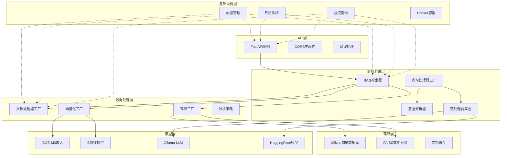

# RAG文档查询系统架构指导文档

## 项目概述

本项目是一个基于检索增强生成(RAG)技术的智能文档查询系统，采用现代微服务架构设计，提供高性能的语义检索和智能问答能力。系统支持多种文档格式处理、多种向量化方法、分布式向量存储，并具备完整的监控和日志体系。

## 核心设计原则

### 1. 模块化设计
- **单一职责原则**：每个模块专注于特定功能领域
- **接口分离**：通过抽象基类定义统一接口
- **依赖注入**：通过工厂模式实现组件解耦
- **配置驱动**：通过环境变量和配置文件管理系统行为

### 2. 可扩展性
- **插件化架构**：支持新的向量化方法、存储后端和处理器
- **水平扩展**：支持分布式部署和负载均衡
- **异步处理**：使用异步I/O提升并发性能

### 3. 容错性与监控
- **健壮的错误处理**：多层异常捕获和优雅降级
- **全链路监控**：集成Prometheus和Grafana
- **结构化日志**：便于问题诊断和性能分析

## 技术架构图



## 核心模块详解

### 1. API服务层 (`src/api/`)
**职责**：提供RESTful API接口，处理HTTP请求和响应

**核心组件**：
- `app.py`：FastAPI应用主体，定义API端点
- `state.py`：应用状态管理，维护全局组件实例

**关键设计**：
- 采用依赖注入模式管理组件生命周期
- 支持文件上传和实时查询
- 完整的错误处理和状态码映射
- CORS支持跨域访问

### 2. 文档处理系统 (`src/data_processing/`)
**职责**：处理多种格式文档，进行智能分块和预处理

**架构特点**：
- **处理器工厂模式** (`processors/factory.py`)：根据文档类型选择合适处理器
- **基础抽象类** (`processors/base.py`)：定义处理器统一接口
- **专用处理器**：
  - `document_processor.py`：主文档处理入口
  - `table_processor.py`：结构化表格数据处理  
  - `unstructured_processor.py`：非结构化文档处理

**分块策略** (`splitting/`):
- 支持多种分块算法：固定长度、语义边界、层次化分块
- 可配置的重叠窗口避免语义断裂
- 针对不同文档类型的优化策略

### 3. 向量化系统 (`src/data_processing/vectorization/`)
**职责**：将文本转换为高维向量表示

**工厂模式设计**：
- `factory.py`：向量化器工厂，支持动态创建
- `base.py`：抽象基类定义统一接口

**支持的向量化方法**：
- **TF-IDF** (`tfidf_vectorizer.py`)：传统统计方法，快速轻量
- **Word2Vec** (`word2vec_vectorizer.py`)：词嵌入模型，捕捉语义关系  
- **BERT** (`bert_vectorizer.py`)：上下文敏感的Transformer模型
- **BGE-M3** (`bge_vectorizer.py`)：针对中文优化的多模态模型

**关键特性**：
- 批量处理优化性能
- 模型缓存减少加载时间
- 设备选择支持CPU/GPU

### 4. 向量存储系统 (`src/data_processing/storage/`)
**职责**：高效存储和检索向量数据

**存储抽象架构**：
- `base.py`：定义存储接口标准
- `factory.py`：存储工厂支持多种后端
- `config.py`：统一配置管理

**存储实现**：
- **Milvus** (`milvus_store.py`)：分布式向量数据库，支持大规模部署
- **FAISS** (`faiss_store.py`)：高性能本地向量索引

**优化特性**：
- 索引策略优化检索速度
- 批量操作提升吞吐量
- 相似度阈值过滤无关结果

### 5. 查询处理系统 (`src/chains/processors/`)
**职责**：分析查询意图，生成精准回答

**处理器架构**：
- `base.py`：查询处理器抽象基类
- `factory.py`：处理器工厂和路由逻辑
- `qa.py`：通用问答处理器，包含意图分析

**意图分析引擎**：
- 基于BGE-M3模型的语义相似度计算
- 预定义意图类型：比较分析、因果解释、列举信息、概念解释、数据统计、操作指导
- 动态意图识别和任务指导生成

**专用处理器**：
- `comparison.py`：比较分析类查询
- `summary.py`：文档摘要生成
- `recommendation.py`：推荐系统
- `chat.py`：对话式交互

### 6. RAG检索系统 (`src/rag/`)
**职责**：实现检索增强生成的核心逻辑

**核心组件**：
- `retriever.py`：RAG检索器主体，整合检索和生成
- `query_processors.py`：查询优化和处理
- `config.py`：RAG专用配置管理
- `field_mapping.py`：字段映射和数据转换

**检索优化技术**：
- 查询分解：将复杂查询拆分为子问题
- 查询扩展：增加相关关键词提升召回率  
- 并行检索：多路径检索提升准确性
- 动态阈值：自适应相似度过滤

### 7. 模型管理系统 (`src/model/`)
**职责**：管理和调用各种语言模型

**组件结构**：
- `llm_factory.py`：LLM工厂，支持多种模型提供商
- `ollama_client.py`：Ollama本地模型客户端

**支持的模型**：
- Ollama本地部署模型
- HuggingFace云端模型
- 自定义模型接入

### 8. 监控系统 (`src/monitoring/`)
**职责**：系统性能监控和指标收集

**监控架构**：
- `metrics.py`：Prometheus指标收集器
- Grafana仪表板可视化
- 全链路性能追踪

**关键指标**：
- API响应时间和成功率
- 向量检索延迟和准确率
- 资源使用率和错误率

## 数据流设计

### 1. 文档处理流程
```
原始文档 → 类型检测 → 专用处理器 → 文本分块 → 向量化 → 存储索引
```

### 2. 查询处理流程  
```
用户查询 → 意图分析 → 查询优化 → 向量检索 → 文档排序 → 答案生成 → 结果返回
```

### 3. 缓存策略
- **L1缓存**：内存中的向量和文档缓存
- **L2缓存**：本地磁盘缓存
- **L3缓存**：分布式Redis缓存(可选)

## 配置管理体系

### 1. 分层配置架构
- **环境变量**：部署时配置
- **配置文件**：默认值和复杂配置
- **运行时参数**：动态调整参数

### 2. 关键配置类别
```python
# LLM配置
LLM_PROVIDER = "ollama"  # ollama, huggingface
LLM_MODEL = "llama2"
LLM_TEMPERATURE = 0.7

# 向量化配置  
EMBEDDING_MODEL = "BAAI/bge-m3"
VECTORIZATION_METHOD = "bge-m3"

# 存储配置
VECTOR_DB_TYPE = "milvus"  # milvus, faiss
MILVUS_HOST = "localhost"
MILVUS_PORT = 19530

# RAG配置
CHUNK_SIZE = 1024
CHUNK_OVERLAP = 200
TOP_K_RESULTS = 3
MIN_SIMILARITY_SCORE = 0.05
```

## 性能优化策略

### 1. 计算优化
- **批量处理**：向量化和检索批量操作
- **异步I/O**：非阻塞文件和网络操作
- **模型缓存**：避免重复加载模型
- **连接池**：数据库连接复用

### 2. 存储优化
- **索引策略**：IVF索引加速相似度搜索
- **数据分片**：支持水平扩展
- **预计算**：常用查询结果预计算

### 3. 内存优化
- **流式处理**：大文件分块加载
- **垃圾回收**：及时释放不用的对象
- **内存映射**：大数据文件内存映射访问

## 部署架构

### 1. 容器化部署
```yaml
# docker-compose.yml主要服务
services:
  app:          # 主应用服务
  milvus:       # 向量数据库
  ollama:       # 本地LLM服务  
  prometheus:   # 监控系统
  grafana:      # 可视化面板
```

### 2. 扩展性考虑
- **水平扩展**：多实例负载均衡
- **垂直扩展**：增加CPU/内存/GPU资源
- **弹性伸缩**：基于负载自动扩缩容

### 3. 高可用设计
- **服务冗余**：关键服务多副本部署
- **故障转移**：自动故障检测和切换
- **数据备份**：定期备份向量数据和配置

## 开发指导

### 1. 添加新功能
#### 新增向量化方法
```python
# 1. 继承BaseVectorizer
class NewVectorizer(BaseVectorizer):
    def vectorize(self, text: str) -> List[float]:
        pass
    
# 2. 注册到工厂
VectorizationFactory._vectorizers['new_method'] = NewVectorizer
```

#### 新增存储后端
```python  
# 1. 继承VectorStoreBase
class NewVectorStore(VectorStoreBase):
    def add_documents(self, docs):
        pass
    
# 2. 注册到工厂
VectorStoreFactory._stores['new_store'] = NewVectorStore
```

#### 新增查询处理器
```python
# 1. 继承QueryProcessor
class NewProcessor(QueryProcessor):
    def process(self, query, documents):
        pass
    
# 2. 注册到工厂
ProcessorFactory.register('new_type', NewProcessor)
```

### 2. 测试策略
- **单元测试**：各模块独立功能测试
- **集成测试**：模块间协作测试  
- **性能测试**：负载和压力测试
- **端到端测试**：完整流程测试

### 3. 代码规范
- **文档字符串**：所有公共方法必须有详细文档
- **类型注解**：使用typing模块标注类型
- **错误处理**：合适的异常捕获和处理
- **日志记录**：关键操作必须记录日志

## 监控运维

### 1. 日志管理
```python
# 结构化日志格式
{
  "timestamp": "2024-01-01T12:00:00Z",
  "level": "INFO", 
  "module": "retriever",
  "message": "Query processed",
  "query_time": 0.15,
  "doc_count": 3
}
```

### 2. 关键指标
- **吞吐量**：QPS (每秒查询数)
- **延迟**：P95响应时间
- **准确率**：答案相关性评分
- **可用性**：服务在线时间

### 3. 告警策略
- **响应时间告警**：>2秒
- **错误率告警**：>5%
- **资源使用告警**：>80%
- **服务不可用告警**：立即通知

## 安全考虑

### 1. 数据安全
- **敏感数据加密**：存储和传输加密
- **访问控制**：基于角色的权限控制
- **数据脱敏**：日志中敏感信息脱敏

### 2. API安全
- **请求限流**：防止恶意请求
- **输入验证**：严格的参数校验
- **HTTPS**：强制加密传输

### 3. 模型安全
- **模型水印**：防止模型盗用
- **对抗样本检测**：识别恶意输入
- **内容过滤**：有害内容检测

## 未来发展方向

### 1. 技术演进
- **多模态支持**：图片、音频、视频处理
- **联邦学习**：分布式模型训练
- **边缘计算**：本地化推理能力

### 2. 功能扩展  
- **实时学习**：增量学习新知识
- **个性化推荐**：基于用户行为的个性化
- **知识图谱**：结构化知识表示

### 3. 性能提升
- **量化加速**：模型量化减少资源占用  
- **专用硬件**：利用AI芯片加速推理
- **算法优化**：更高效的检索算法

---

## 总结

本RAG文档查询系统采用现代化的微服务架构，具备高度的模块化、可扩展性和可维护性。通过工厂模式、依赖注入、配置驱动等设计模式，实现了组件间的松耦合和高内聚。系统支持多种技术路线和部署方式，能够适应不同规模和场景的需求。

开发团队应严格遵循本架构指导文档，确保新功能开发符合整体设计理念，维护系统的一致性和稳定性。同时，需要持续关注技术发展趋势，适时进行架构演进和优化。