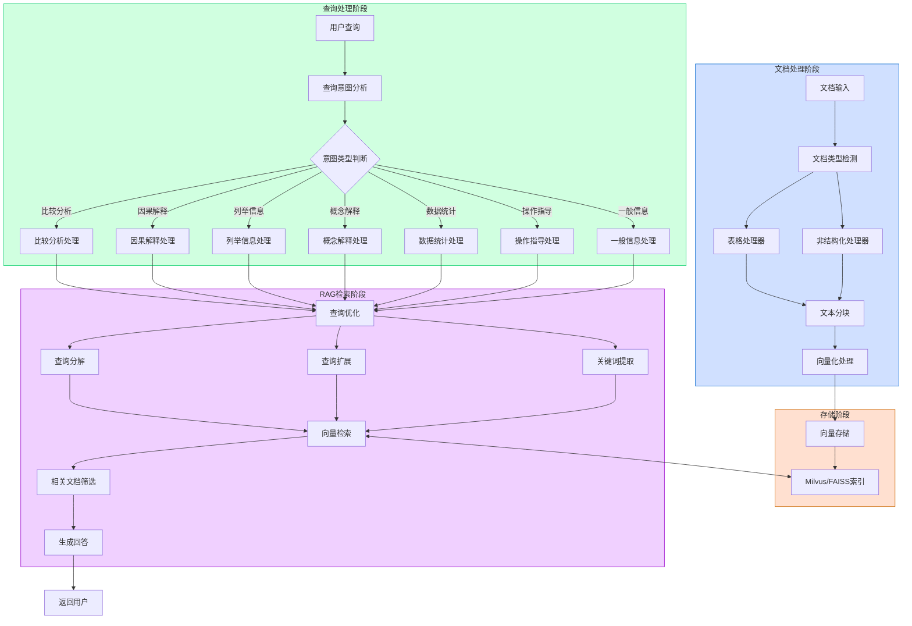
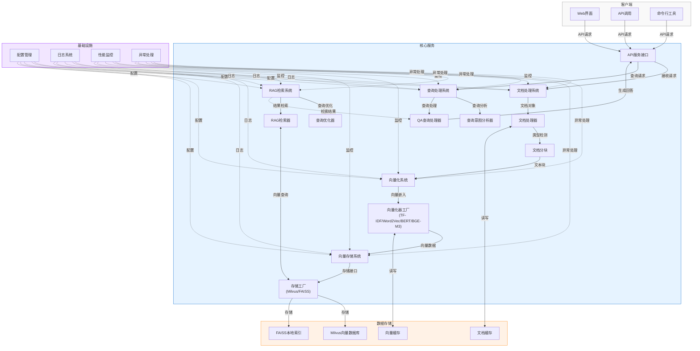

# RAG文档查询系统

## 项目简介

RAG文档查询系统是一个基于向量数据库的智能文档处理和语义检索平台，旨在提供高效、精准的文档理解与问答能力。系统采用现代自然语言处理技术，能够处理多种格式的文档，进行智能分块、向量化和语义检索，为用户提供准确的信息查询服务。

本系统适用于知识管理、客户服务、技术支持、数据分析等场景，可以帮助用户快速从大量文档中提取关键信息，理解文档内容，回答复杂问题。

### 核心特点

- **多格式文档处理**：支持文本、PDF、Word、Excel、Markdown、HTML等多种文档格式
- **智能文本分块**：根据文档类型和内容自动选择适当的分块策略，保持语义完整性
- **高效向量化**：提供多种向量化方法（TF-IDF、Word2Vec、BERT、BGE-M3），满足不同需求
- **精准语义检索**：基于向量相似度计算，支持复杂查询和语义匹配
- **查询意图分析**：基于嵌入模型的查询意图分析，提高回答质量
- **灵活配置**：分层配置系统，支持环境变量和配置文件

### 业务流程图

下图展示了RAG文档查询系统的完整业务流程，从文档输入到查询回答的整个过程：



## 技术栈

### 编程语言
- Python 3.8+（推荐使用Python 3.10）

### 框架与库
- LangChain 0.1.0+：大型语言模型应用开发框架
  - langchain-core：核心组件
  - langchain-community：社区集成组件
  - langchain-huggingface：Hugging Face集成
- Transformers：自然语言处理模型库
- FastAPI：Web API框架
- Unstructured：非结构化文档处理

### 向量数据库
- Milvus 2.3+：分布式向量数据库（主要支持）
- FAISS：高效向量检索库（本地支持）

### 机器学习与向量化
- PyTorch 2.0+：深度学习框架
- Sentence-Transformers 2.2+：文本嵌入模型
- scikit-learn：传统机器学习库（用于TF-IDF等）
- gensim：主题建模与文档相似度（用于Word2Vec等）
- numpy：科学计算
- pandas：数据处理

### 文档处理
- python-magic：文件类型检测
- pdf2image：PDF处理
- pytesseract：OCR文字识别
- python-docx：Word文档处理
- openpyxl：Excel文档处理
- BeautifulSoup4：HTML解析
- Markdown：Markdown解析

### 自然语言处理工具
- jieba：中文分词
- ollama：本地模型服务

### 监控与日志
- prometheus-client：性能监控
- python-json-logger：结构化日志记录
- tenacity：重试机制

### 实用工具
- python-dotenv：环境变量管理
- tqdm：进度条显示
- aiohttp：异步HTTP客户端
- requests：HTTP客户端
- python-multipart：用于处理multipart/form-data

### 技术架构图

下图展示了RAG文档查询系统的技术架构设计：



## 安装与运行

### 环境要求
- 操作系统：Windows、Linux或macOS
- Python 3.8+
- Docker（用于Milvus向量数据库）
- 至少8GB RAM（推荐16GB+）
- 磁盘空间：至少5GB（视文档规模可能需要更多）

### 安装步骤

1. **克隆项目仓库**（或下载源代码）：
```bash
git clone <repository-url>
cd ai-with-data
```

2. **创建Python虚拟环境**：
```bash
# 创建虚拟环境
python -m venv venv

# 激活环境 (Windows)
venv\Scripts\activate

# 激活环境 (Linux/Mac)
source venv/bin/activate
```

3. **安装系统依赖**：

```bash
# Ubuntu/Debian
sudo apt-get update
sudo apt-get install -y \
    build-essential \
    libmagic-dev \
    poppler-utils \
    tesseract-ocr \
    tesseract-ocr-chi-sim \
    libreoffice \
    pandoc

# MacOS
brew install \
    libmagic \
    poppler \
    tesseract \
    tesseract-lang \
    libreoffice \
    pandoc
```

4. **安装Python依赖**：
```bash
pip install -r requirements.txt
```

5. **安装并启动Milvus向量数据库**：
```bash
# 下载Milvus Standalone配置文件
wget https://github.com/milvus-io/milvus/releases/download/v2.3.3/milvus-standalone-docker-compose.yml -O docker-compose.yml

# 启动Milvus
docker-compose up -d

# 检查服务状态
docker-compose ps
```

6. **配置系统**：
```bash
# 复制示例配置
cp .env.example .env

# 编辑配置
nano .env
```

7. **启动系统**：
```bash
python src/main.py
```

## 目录结构

```
.
├── src/                         # 源代码目录
│   ├── api/                     # API服务接口
│   ├── chains/                  # 语言模型链和提示工程
│   │   └── processors/         # 查询处理器，包含QA处理器
│   ├── data_processing/         # 数据处理模块
│   │   ├── processors/         # 文档处理器
│   │   ├── splitting/          # 文本分块策略
│   │   ├── storage/            # 向量存储实现
│   │   ├── utils/              # 数据处理工具
│   │   └── vectorization/      # 向量化器实现
│   ├── model/                   # 模型定义和工厂
│   ├── monitoring/              # 监控和指标收集
│   ├── rag/                     # RAG检索增强生成
│   └── utils/                   # 通用工具函数
├── tests/                       # 测试代码和数据
├── data/                        # 数据目录
│   ├── raw/                     # 原始文档
│   ├── processed/               # 处理后文档
│   └── models/                  # 本地模型缓存
├── logs/                        # 日志文件
├── requirements.txt             # 项目依赖
├── .env.example                 # 环境变量模板
└── README.md                    # 项目文档 
```

## 功能模块

### 1. 文档处理系统

**功能描述**：负责接收、解析和处理各种格式的文档，将其转换为适合向量化的格式。

**实现方式**：
- 使用`DocumentProcessor`作为入口，根据文档类型选择合适的处理器
- 表格数据使用`TableProcessor`处理，保留结构信息
- 非结构化数据使用`UnstructuredProcessor`处理，提取文本和元数据
- 文档处理后通过分块策略将文本分为适合向量化的段落

**相关文件**：
- `src/data_processing/processors/document_processor.py`
- `src/data_processing/processors/table_processor.py`
- `src/data_processing/processors/unstructured_processor.py`
- `src/data_processing/splitting/text_splitter.py`

### 2. 向量化系统

**功能描述**：将文档文本转换为高维向量表示，支持多种向量化方法。

**实现方式**：
- 通过`VectorizationFactory`创建不同类型的向量化器
  - 支持从环境变量和配置文件读取向量化参数
  - 实现懒加载机制，按需初始化向量化模型
  - 提供线程安全的模型访问和缓存管理
- 支持多种向量化方法：
  - **TF-IDF**：传统词袋模型，基于词频-逆文档频率
  - **Word2Vec**：词嵌入模型，捕捉语义关系
  - **BERT**：基于Transformer的上下文敏感嵌入
  - **BGE-M3**：针对中文优化的高性能嵌入模型
- 所有向量化器继承自`BaseVectorizer`，提供统一接口：
  - `vectorize`：单文本向量化
  - `batch_vectorize`：批量文本向量化
  - `similarity`：计算向量相似度
- 向量化结果被发送到向量存储系统

**向量化配置**：
- 每种向量化方法支持不同的参数配置：
  - TF-IDF：max_features、use_idf等
  - Word2Vec：vector_size、window、min_count等
  - BERT和BGE-M3：model_name、max_length、device等
- 支持模型缓存和预训练模型加载

**相关文件**：
- `src/data_processing/vectorization/factory.py`
- `src/data_processing/vectorization/base.py`
- `src/data_processing/vectorization/tfidf_vectorizer.py`
- `src/data_processing/vectorization/word2vec_vectorizer.py`
- `src/data_processing/vectorization/bert_vectorizer.py`
- `src/data_processing/vectorization/bge_vectorizer.py`

### 3. 向量存储系统

**功能描述**：存储和检索向量化后的文档，支持高效的相似度搜索。

**实现方式**：
- 使用`VectorStoreFactory`创建不同类型的向量存储
- 主要支持Milvus分布式向量数据库
- 同时支持FAISS作为本地向量索引
- 提供统一的文档添加、搜索和删除接口

**相关文件**：
- `src/data_processing/storage/factory.py`
- `src/data_processing/storage/base.py`
- `src/data_processing/storage/milvus_store.py`
- `src/data_processing/storage/faiss_store.py`

### 4. 查询处理系统

**功能描述**：处理用户查询，分析查询意图，生成准确的回答。

**实现方式**：
- 使用`QueryIntentAnalyzer`分析查询意图，基于嵌入模型比较查询与预定义意图示例的相似度
  - 为每种意图预定义多个示例问题，计算平均向量作为该意图的表示
  - 计算用户查询向量与各意图向量的相似度，选择最相似的意图
  - 当最高相似度低于0.5阈值时，将查询归类为"一般信息查询"
- `QAQueryProcessor`作为通用文档处理器，处理各种格式的文档查询
- 实现了智能的格式检测与预处理
- 根据查询意图生成任务指导，引导语言模型生成更精准的回答

**支持的意图类型**：
- 比较分析：对两个或多个实体进行比较
- 因果解释：解释原因、机制或方法
- 列举信息：列举信息类查询
- 概念解释：解释专业术语或概念
- 数据统计：涉及数字或统计数据的查询
- 操作指导：提供步骤、方法或使用说明
- 一般信息查询：不符合以上类型的查询

**相关文件**：
- `src/chains/processors/qa.py`
- `src/chains/processors/base.py`
- `src/chains/chain_factory.py`

### 5. RAG检索增强生成

**功能描述**：结合检索和生成功能，提供基于文档的准确回答。

**实现方式**：
- 使用`RAGRetriever`提供检索增强生成功能
  - 封装了`SerializableRetriever`和`VectorStoreRetriever`，确保检索过程可序列化和可靠
  - 支持异步并行检索，提高大型文档库的查询性能
- 实现动态的关键词提取和查询优化
  - 通过`QueryOptimizer`组件优化原始查询
  - 支持三种优化方法：查询分解(decompose_query)、查询扩展(expand_query)和关键词提取(extract_keywords)
- 智能相似度阈值管理
  - 动态调整相似度阈值，提高检索灵敏度
  - 自适应过滤低相关度的检索结果
- 并行向量检索提高性能和准确率
  - 支持多种检索策略组合，如BM25与向量混合检索
  - 实现多路径检索与结果合并，提高召回率

**查询优化器**：
- 分解复杂查询为多个简单查询
- 扩展查询关键词，增加相关术语
- 提取关键词并赋予权重，优化检索效果

**相关文件**：
- `src/rag/retriever.py`
- `src/rag/config.py`
- `src/rag/query_processors.py`
- `src/rag/query_optimizer.py`

## 最佳实践

### 文档处理最佳实践

#### 文档分块策略
- 对于大型文档（>100页），建议使用较大的分块尺寸（1024-2048字符）减少向量数量
- 对于高精度要求场景，使用较小的分块（256-512字符）并增加重叠区域
- 对于表格和结构化数据，使用基于语义的分块而非固定大小分块

#### 向量化选择
- 中文文档推荐使用BGE-M3模型，具有最佳的语义理解能力
- 对于特定领域（如医疗、法律）可以使用领域专用模型
- 计算资源有限时可选择TF-IDF或Word2Vec，牺牲部分精度换取效率

#### 存储优化
- 在生产环境使用Milvus集群部署，支持水平扩展
- 开发和小型部署可使用FAISS本地索引
- 对频繁访问的文档实施缓存策略

### 性能优化技巧

#### 并行处理
- 利用`concurrent.futures`进行文档并行处理
- 配置适当的批处理大小，建议1MB或50-100个文件为一批
- 调整`MAX_WORKERS`参数，通常设为CPU核心数的1-2倍

#### 缓存策略
- 对向量化结果进行本地缓存，避免重复计算
- 设置合理的缓存过期策略，定期刷新保持数据最新
- 使用LRU（最近最少使用）缓存算法优化内存使用

#### 查询优化
- 激活查询优化功能（`USE_QUERY_OPTIMIZATION=true`）
- 对重复性高的查询实施结果缓存
- 启用混合检索增强检索准确性

### 性能评估

#### 文档处理性能

| 文档类型  | 平均处理时间  | 吞吐量      |
|-------|---------|----------|
| 纯文本   | 0.5秒/MB | 120MB/分钟 |
| PDF   | 2.5秒/MB | 24MB/分钟  |
| Word  | 1.5秒/MB | 40MB/分钟  |
| Excel | 1.8秒/MB | 33MB/分钟  |

#### 向量化性能比较

| 向量化方法    | 处理速度 | 检索准确率 | 内存占用 | 适用场景   |
|----------|------|-------|------|--------|
| TF-IDF   | 非常快  | 中等    | 低    | 简单文本匹配 |
| Word2Vec | 快    | 中等    | 中    | 一般语义匹配 |
| BERT     | 慢    | 高     | 高    | 复杂查询理解 |
| BGE-M3   | 中等   | 非常高   | 中高   | 中文语义理解 |

#### 系统资源需求

**最小配置**:
- CPU: 4核
- 内存: 8GB
- 存储: 5GB
- 适用于: 小型文档库(<1000文档)

**推荐配置**:
- CPU: 8核+
- 内存: 16GB+
- GPU: 支持CUDA的GPU (4GB+显存)
- 存储: 20GB+ SSD
- 适用于: 中大型文档库(1000-10000文档)

**大规模部署**:
- CPU: 16核+
- 内存: 32GB+
- GPU: 专用GPU (8GB+显存)
- 存储: 100GB+ SSD
- 适用于: 大型文档库(>10000文档)

### 配置指南

系统使用分层配置管理：

1. **环境变量** - `.env` 文件存储配置值
2. **配置模块** - `config.py` 处理配置加载和默认值

### 常用配置参数

```
# 向量化模型
EMBEDDING_MODEL=BAAI/bge-m3  # 默认中文优化模型
EMBEDDING_DEVICE=cpu         # 使用的设备，可选 cpu 或 cuda:0

# 文档分块
CHUNK_SIZE=1024     # 分块大小
CHUNK_OVERLAP=200   # 分块重叠大小

# 检索设置
TOP_K_RESULTS=3     # 返回结果数量
MIN_SIMILARITY_SCORE=0.2  # 最小相似度阈值
SEARCH_MULTIPLIER=3.0     # 搜索结果数量乘数

# 向量存储配置
VECTOR_DB_TYPE=milvus  # 向量存储类型
MILVUS_URI=http://localhost:19530  # Milvus服务器URI
MILVUS_COLLECTION=document_store  # Milvus集合名称

# 日志设置
LOG_LEVEL=INFO    # 日志级别
LOG_FILE=logs/app.log  # 日志文件
STRUCTURED_LOGGING=true # 是否使用结构化日志
```

### 向量化方法配置

每种向量化方法支持特定的配置参数：

#### TF-IDF 配置
```
TFIDF_MAX_FEATURES=5000  # 特征数量
TFIDF_USE_IDF=true       # 是否使用IDF
VECTORIZATION_CACHE_DIR=./cache/vectorization  # 缓存目录
```

#### Word2Vec 配置
```
WORD2VEC_VECTOR_SIZE=100  # 向量维度
WORD2VEC_WINDOW=5         # 窗口大小
WORD2VEC_MIN_COUNT=1      # 最小词频
WORD2VEC_WORKERS=4        # 工作线程数
WORD2VEC_PRETRAINED_PATH=./data/models/word2vec  # 预训练模型路径
```

#### BERT 配置
```
BERT_MODEL_NAME=bert-base-chinese  # 模型名称
BERT_MAX_LENGTH=512               # 最大长度
BERT_DEVICE=cpu                   # 使用设备
```

#### BGE-M3 配置
```
BGE_MODEL_NAME=BAAI/bge-m3        # 模型名称
BGE_MAX_LENGTH=512                # 最大长度
BGE_DEVICE=cpu                    # 使用设备
```

### RAG 配置参数

```
USE_QUERY_OPTIMIZATION=true   # 是否使用查询优化
PARALLEL_RETRIEVAL=true       # 是否使用并行检索
MAX_PARALLEL_REQUESTS=5       # 最大并行请求数
RETRIEVAL_TIMEOUT=30          # 检索超时时间(秒)
USE_HYBRID_SEARCH=true        # 是否使用混合检索
```
### 日志记录与监控

系统提供全面的日志和监控功能：
- 记录所有搜索请求和处理过程
- 监控系统性能和资源使用
- 提供错误和警告的详细信息
- 支持日志轮转和归档

## 贡献指南

### 添加新功能

1. **添加新的处理器**：
   - 在 `src/data_processing/processors/` 目录下创建新处理器
   - 继承 `BaseDocumentProcessor` 类
   - 实现 `process_file` 和 `process_text` 方法
   - 在 `DocumentProcessor` 中添加对新处理器的引用

2. **添加新的向量化方法**：
   - 在 `src/data_processing/vectorization/` 目录下创建新向量化器
   - 继承 `BaseVectorizer` 类
   - 实现 `vectorize` 和 `batch_vectorize` 方法 
   - 在 `VectorizationFactory` 中注册新方法

3. **添加新的向量存储**：
   - 在 `src/data_processing/storage/` 目录下创建新存储实现
   - 继承 `VectorStoreBase` 类
   - 实现所需方法（add_documents, search等）
   - 在 `VectorStoreFactory` 中注册新存储实现

## 许可证

本项目采用 MIT 开源协议。详情请参阅 LICENSE 文件。

## 示例与用法

### 1. 基本文档处理和检索示例

```python
from src.data_processing.processors.document_processor import DocumentProcessor
from src.data_processing.processors.base import DocumentType, ProcessorConfig
from src.data_processing.storage.factory import VectorStoreFactory
from src.data_processing.storage.base import VectorStoreConfig, VectorStoreType

# 创建处理器配置
config = ProcessorConfig(
    doc_type=DocumentType.CHINESE,
    chunk_size=500,
    chunk_overlap=50
)

# 创建文档处理器
processor = DocumentProcessor(config)

# 处理文档
with open("sample.pdf", "rb") as f:
    docs = processor.process_file(
        file_content=f.read(),
        filename="sample.pdf",
        mime_type="application/pdf"
    )

# 创建向量存储配置
store_config = VectorStoreConfig(
    store_type=VectorStoreType.MILVUS,
    model_name="BAAI/bge-m3",
    connection_args={
        "uri": "http://localhost:19530",
        "collection_name": "rag_collection",
        "vector_field": "embedding",
        "text_field": "content",
        "metadata_field": "metadata"
    }
)

# 创建向量存储实例
store = VectorStoreFactory.create_store(store_config)

# 添加文档到向量存储
texts = [doc.page_content for doc in docs]
store.add_documents(texts)

# 查询相关文档
results = store.search("查询文本", k=3)
```

### 2. 使用查询意图分析

```python
from src.chains.processors.qa import QueryIntentAnalyzer

# 创建查询意图分析器
analyzer = QueryIntentAnalyzer()

# 分析查询意图
query = "比较一下最新款笔记本电脑的性能和价格"
intent = analyzer.analyze_intent(query)

print(f"查询: {query}")
print(f"意图: {intent}")  # 输出: 比较分析
```

### 3. 完整RAG查询流程

```python
from src.rag.retriever import RAGRetriever
from src.rag.config import RAGConfig
from src.data_processing.vectorization.factory import VectorizationFactory

# 创建嵌入模型
vectorizer = VectorizationFactory.create_vectorizer(method="bge-m3")

# 创建RAG配置
config = RAGConfig(
    embedding_model="BAAI/bge-m3",
    vector_store_type="milvus",
    vector_store_uri="http://localhost:19530",
    vector_store_collection="document_store"
)

# 创建RAG检索器
retriever = RAGRetriever(config)

# 执行查询
query = "哪款笔记本电脑性价比最高？"
answer = retriever.generate_answer(query)

print(f"问题: {query}")
print(f"回答: {answer}")
```